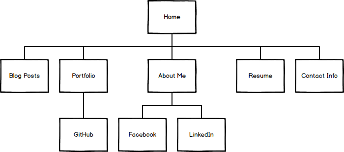

1. What are the 6 Phases of Web Design and how is one phase important to the others?
	1. Information Gathering:
		a. Identify:
			i. Purpose: provide information, promote a service, sell a product, etc.
			ii. Goals: make money, spread information.
			iii. Audience: demographics will help with planning and design elements.
			iv. Content: specific information, product or service, online ordering.
		b. The information that you gather will influence the planning and design of the site.
	2. Planning
		a. Once the necessary information has been gathered, a developer would create a site map based on this information.
		b. A site map is a list of all the main topic areas of a site, as well as sub-topics.
		c. Website user interface should be easy to navigate: this is the basis of the site map.
		d. During the planning phase, one should determine what sort of technologies will be necessary, which will aid in the design and development phases.
		
	3. Design
		a. During the design phase, one creates a wireframe and decides on the CSS (colors, fonts) elements of the site.
		b. Understanding target audience is key for this phase.
		c. Will need to gather graphical elements, such as the company logo, during this phase.
		d. A design prototype (mock-up) is necessary before development.
		e. Developer and designer roles should be in tight communication during this phase.
		
	4. Development
		a. At this point, the website itself is created.
		b. Add HTML and CSS to bring the design to life.
		c. Implement content management systems such as WordPress during this phase.
		d. In-progress site should be made available by the developer to the designer so that necessary adjustments can be made.
		e. Once development is completed, it is time to test.
		
	5. Testing and Delivery
		a. Are all scripts working?
		b. Are all links working?
		c. Is the site viewable across most browsers?
		d. Once basic testing has been done, it's time to upload the site to a hosting server through an File Transfer Protocol.
		e. Install plugins and perform Search Engine Optimization (which title, description, and keyword tags will help the site achieve higher search engine rankings).
		f. Launch the site!
		g. Now that the site is viewable to the public, gather feedback from your target audience.
	6. Maintenance
		a. The site should continually be improved based on the feedback received from audience.
		b. Provide new content so as to receive repeat visitors. CMSs such as Wordpress can be used to update sites without the need of a developer
		
2. Create a site map for a website and display it in a markdown file. Should include home and pages for contact, blog, about, projects, and more depth and pages.
	• Markdown file: 
		○ 
		
	• What is your site's primary goal or purpose? What kind of content will your site feature?
		○ The site's primary purpose is to increase the interest that a user has in me as a potential resource for their company or project.
		○ Site will include:
			§ Blog Posts
			§ Portfolio of projects
			§ Resume
			§ About Me, including photo
			§ Contact Info
			§ Links to my Facebook, Twitter, LinkedIn, & GitHub.
			
	• What is your target audience's interests and how do you see your site addressing them?
		○ My target audience's interest is finding qualified web developers to work on their businesses or projects. My site will highlight my abilities through project demonstrations, a resume, and technical blog posts. I will use social media to make myself seem like a more attractive candidate beyond my technical abilities as well.
		
	• What is the primary "action" the user should take when coming to your site? Do you want them to search for information, contact you, or see your portfolio? It's ok to have several actions at once, or different actions for different kinds of visitors.
		○ The primary action that the user should take when coming to my site is to search for information about me and eventually contact me for job or project collaboration offers. If a user asks me to speak for a group or wants to get coffee with me to get to know me personally, that's fine too!
	
3. What is user experience design and why is it valuable? 
	1. User experience (UX) is how users perceive a product. User experience design (UXD or UED) is the process of enhancing a user's perception of a product by improving the ease of use, understanding of value, utility, accessibility, efficiency, and pleasure provided in the interaction between the user and the product.
	2. UXD is valuable because it provides a competitive edge to websites that strongly affects the bottom line in a 1.5 billion user market. The websites that stand out today are the ones that are pleasant to the user.

4. What UXD considerations should be made?
	1. Does the user like the product? If not, change the product to better please the user. 
	2. Is the system too complex? How can it be made simpler and more user friendly? If a product is made more simple to interact with, a user will be happier when using it.
	3. Does the project have the resources for UXD? If not, how can time and resources be diverted to it? Contracting is an option.
	4. Does the project have the budget for UXD? UXD can be performed later in the products lifespan if not.
	5. What is the timeframe of the project? If the project does not have the time for UXD before launch, then it can be done later.
		
5. What are the main things someone should know about design and user experience?
	1. UXD isn't one size fits all. All humans are unique, and one must aim to please the demographic cross-section that is your audience.
	2. Can't be assessed solely with traditional metrics, such as page views, bounce rates, or conversion rates. Make assumptions and test assumptions on users. Collect anecdotal evidence.
	3. Not the same thing as usability. UXD is about the feeling of the user, while usability is about the user-friendliness and efficiency of the interface. Usability IS a big part of UXD, though.

6. Which parts of the challenge did you find tedious?
The part of the challenge that I found most tedious was having to find the correct software to create site-maps with. There were so many options that were free that seemed good, but upon using them they seemed unsatisfactory. I ended up settling for Balsamiq, though that only has a 30 day free trial. I'm going to have to keep searching for free software, and if I can't find one, will go ahead and buy that one.