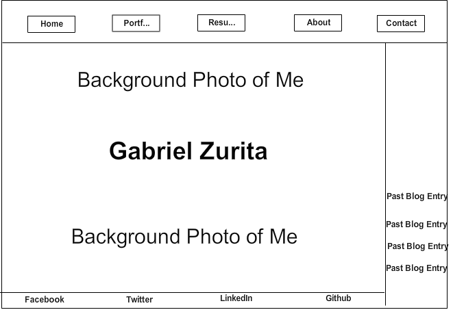
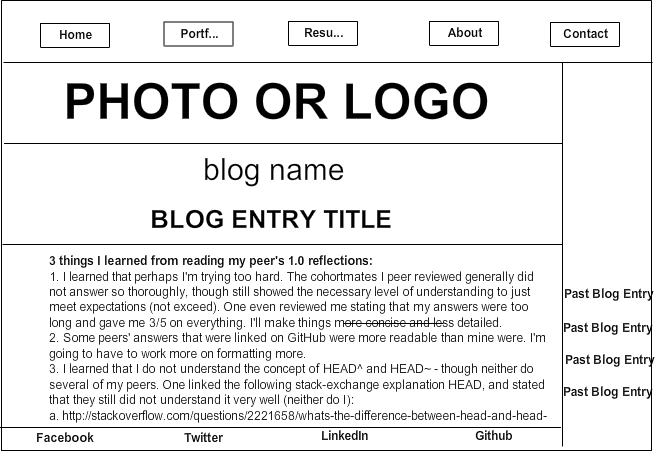

• **What is a wireframe?**

Wireframing is a visual representation of the skeletal framework of a website. It is the basic layout of the website without the HTML necessary to structure the site, or the CSS to style the site. It's essentially the most rudimentary way to design site one is attempting to make.

• **What are the benefits of wireframing?**

Wireframing is beneficial in that it allows designers to plan a webpage layout without having to worry about HTML or CSS. Wireframing leads to a better understanding of the basic framework/elements of site, and can lead to UX improvements such as making the site navigation more user friendly. Additionally, it makes it easy to make changes and immediately see the results of these changes.

• **Create a wireframe to model a website layout.**

**About Me Landing Page:**

**Blog Landing Page (Current Blog):**

• **Did you enjoy wireframing your site?**

It was enjoyable to wireframe my site, though it was quite frustrating finding the right, free software solution for wireframing. I think I would have enjoyed the process more if I had used pencil and paper. Wireframing my site really gave me an idea of how I want to achieve capturing a user's attention and imagination, and getting them to work with me.

• **Did you revise your wireframe or stick with your first idea?**

I had several revisions of my wireframe site, and kept changing it until the final product was satisfactory. I will continue to change it until I'm read to begin coding it.

• **What questions did you ask during this challenge? What resources did you find to help you answer them?**

My main question was what free wireframing software would be best to use. I used Reddit and Quora to look for potential software, downloaded, and tried each of the most talked about and upvoted ones.

• **Which parts of the challenge did you enjoy and which parts did you find tedious?**

I tried to find a free wireframing and sitemap tool that allowed one to work collaboratively with others, since the options provided in the resources I read from Canvas were not satisfactory. I searched through Google, Reddit, and I also tried Quora. I found and tried several alternatives, such as Mockingbird, Cacoo, and I ended up settling on Mockflow, which I will use for my 2.7 peer pairing. No free options were very satisfactory.
