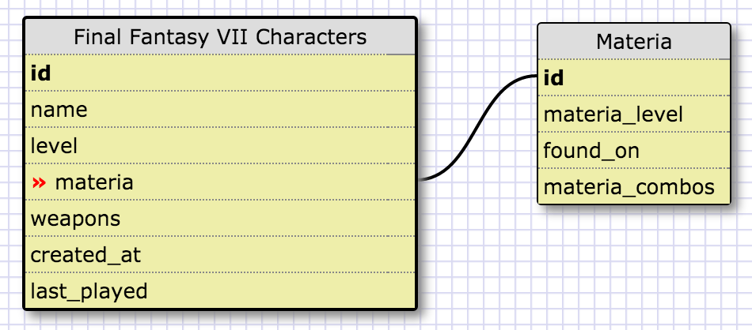
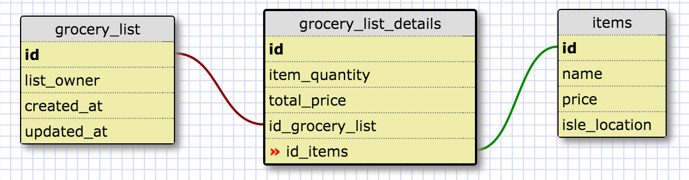

**One-to-One Relationship**

This is a one-to-one releationship because each character in the game Final Fantasy VII can have Materia
that levels up along with the character. This materia belongs to that character alone and is unique in the
world. They are connected by the materia field in the character and the id field in materia.

**Many-to-Many Relationship**

**What is a one-to-one database?**
One-to-one relationships are things that exist as pairs. Each row in one database is linked to one and only one row in a separate table. 

**When would you use a one-to-one database? (Think generally, not in terms of the example you created).**
One-to-one relationships mean that the data could exist in one table, but there are performance improvements that come from separating the data into separate tables.

**What is a many-to-many database?**
A many-to-many database is one in which one or more rows in one table can be linked to zero, one, or more rows in another table. The two separate tables are linked together by an intermediary, mapping table.

**When would you use a many-to-many database? (Think generally, not in terms of the example you created).**
When one or more items in one table can be related to zero, one, or more items in another table.

**What is confusing about database schemas? What makes sense?** It's seemingly easy to understand database schemas, but it's more difficult to think of examples. I thought I understood the concepts fairly well, but coming up with examples took me a lot longer than I thought it would.